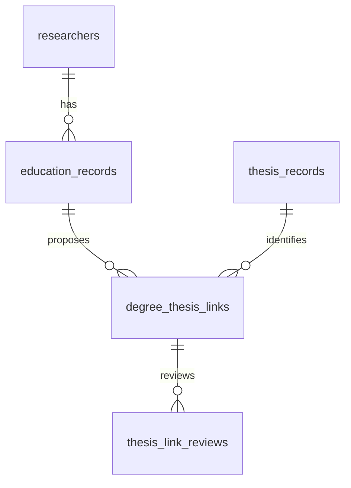

# 박사학위–졸업논문 연결

2026-09-09. 국내·해외 박사학위자 모두를 대상으로 한다. 교수 요약에 `thesis_url` 하나를 추가하는 대신 기존 비공개 연구자 식별자 DB를 버전 2로 확장해 학위, 논문, 연결 검토를 나눈다. 기존 원본 DB와 공개 파일은 수정하지 않는다.



## 테이블과 컬럼의 책임

| 테이블 | 주요 컬럼과 제약 | 용도 |
| --- | --- | --- |
| `education_records` | `degree_id` PK, `source_professor_uid` FK, `(source_snapshot_sha256, source_education_id)` UNIQUE | 원본의 개별 박사학위와 출처 스냅샷을 연결한다. 복수 박사학위를 막는 사람별 UNIQUE는 두지 않는다. |
| `education_records` | 기관 원문·표준명, 국가 원문·코드, `award_year`, `domestic_status`, `query_status` | 실제 학위연도와 기관 근거를 보존한다. 국가 미확인과 모순을 구분하고 현재 재직 학과를 가져오지 않는다. |
| `thesis_records` | `thesis_id` PK, `(provider, provider_record_id)` UNIQUE, 제목·저자·출판연도·출처 URL·DOI | RISS 및 OpenAlex의 논문 기록. 공급자가 보고한 학위종류·학과는 별도 컬럼이며 미제공 시 NULL이다. |
| `degree_thesis_links` | `(degree_id, thesis_id)` PK 및 FK, `status`, `match_method`, `evidence`, 검토자·시각 | 한 학위에 여러 후보를 둘 수 있다. 확정 상태에서는 학위별·논문별 유일성을 강제한다. |
| `thesis_link_reviews` | 연결 FK, 이전·새 상태, 검토자·시각·관측 근거 | 검토 이력을 누적하며 기존 이력의 수정·삭제를 막는다. |
| `thesis_import_batches` | 입력 내용의 SHA-256 UNIQUE, 종류·시각·집계·감사 정보 | 같은 입력을 다시 가져와도 중복 생성하지 않는다. 오류가 있으면 해당 일괄 입력 전체를 되돌린다. |

원본의 정수 `education_id`는 DB 재생성 때 다른 행에 재사용될 수 있으므로 스냅샷 지문과 함께 식별한다. 같은 스냅샷의 학위·논문 메타데이터가 달라지면 덮어쓰지 않고 충돌을 보고한다. DOI는 중복 탐지에 사용하며 연구자 PK나 자동 병합 근거로 사용하지 않는다.

`v_phd_theses`는 논문이 아직 연결되지 않은 국내·해외 학위도 LEFT JOIN으로 남긴다. NULL 연결은 ‘논문이 없음’이라는 판정이 아니다. `v_domestic_phd_theses`는 국내·국내 국가 미해결 학위에 한정하며 국가 충돌은 전체 조회에서 따로 검토한다. `other_records_same_doi`는 공급자 기록 간 중복 가능성을 보여준다.

## 후보와 확정

원본 OpenAlex 자료에서 `work_type='dissertation'`, 기존 저자 판정 `keep`, 실제 수여연도와 출판연도의 차이가 ±1년 이내인 기록을 후보로 연결한다. 국내·해외 모두 적용하며 국가 충돌·미해결 유형, 복수 학위의 모호한 연결, 동일 논문의 메타데이터 충돌은 검토 대상으로 남긴다. 이미 존재하는 자료를 사용하며 새 RISS 검색 결과로 표시하지 않는다.

OpenAlex의 `dissertation`은 박사학위논문이라는 증거가 아니다. 원본 저자 매칭의 오류, 석사논문, 지도교수와 학생의 잘못된 연결 가능성이 남는다. 논문 소속이 학위기관과 같아도 학위 수여 사실을 입증하지 않는다. 자동 입력은 `candidate` 또는 `conflict`만 만들며 `verified`를 만들지 않는다.

확정에는 사람이 확인한 RISS 학위논문 상세 기록, 해당 논문의 제목, 저자, 박사학위 종류, 수여기관, 수여연도와 비공개 검토 기록 참조를 요구한다. 논문 제목과 학위의 저자·기관·연도를 실제 연결 대상과 대조한다. 학과를 확정할 때는 원문에 명시된 학과와 학과 확인 표시도 필요하다. CLI는 검토 근거의 형식과 일관성을 검사하며 외부 페이지를 대신 읽거나 본인인증을 수행하지 않는다.

같은 논문이 서로 다른 연구자에게 연결되면 충돌로 남긴다. 같은 DOI의 별도 기록이나 이미 확정된 다른 연결은 해소하기 전까지 새 확정을 막는다. 재수집은 이전 검토 결정을 덮어쓰지 않는다.

## 실행

실제 이름·외부 식별자·논문 제목이 있는 DB와 입력 파일은 전용 `private` 또는 `.private` 폴더에서만 관리한다. 기존 식별자 DB를 먼저 백업한 뒤 마이그레이션한다. 파일 권한은 0600, 전용 폴더는 0700이며 Git·공개 다운로드에 포함하지 않는다.

```bash
python3 backend/scripts/build_riss_queue.py \
  --private-project "$PRIVATE_BUILD_PROJECT" \
  --public-data public/data/dashboard.json --year 2026 --scope all \
  --output "$PRIVATE_DIRECTORY/riss-all-query-queue.json"

python3 backend/scripts/build_thesis_seed.py \
  --private-project "$PRIVATE_BUILD_PROJECT" \
  --public-data public/data/dashboard.json --year 2026 \
  --riss-queue "$PRIVATE_DIRECTORY/riss-all-query-queue.json" \
  --output "$PRIVATE_DIRECTORY/thesis-seed.json"

python3 backend/scripts/thesis_registry.py migrate \
  --database "$PRIVATE_DIRECTORY/researcher-identity.sqlite"

python3 backend/scripts/thesis_registry.py import \
  --database "$PRIVATE_DIRECTORY/researcher-identity.sqlite" \
  --records-json "$PRIVATE_DIRECTORY/thesis-seed.json"

# RISS 키 발급 및 실제 수집 후 사용한다.
python3 backend/scripts/thesis_registry.py import-riss \
  --database "$PRIVATE_DIRECTORY/researcher-identity.sqlite" \
  --candidates-json "$PRIVATE_DIRECTORY/riss-candidates.json"

python3 backend/scripts/thesis_registry.py summary \
  --database "$PRIVATE_DIRECTORY/researcher-identity.sqlite"
```

RISS 후보를 기존 학위에 연결할 때는 원본 연구자 ID·익명 ID·기관·연도·국가·이름을 대조한다. 여러 스냅샷에 동일한 학위가 있으면 `--source-snapshot-sha256`으로 대상을 지정해야 하며 임의로 최신 행을 선택하지 않는다. 수집기는 국내 `stype=id`, 해외 `stype=od`를 사용한다. 아직 RISS 키가 없어 실조회나 새로운 RISS 학과 검증은 수행하지 않았다.

현재 웹은 비공개 DB와 직접 연결되지 않는다. 공개 화면의 익명 정책을 유지하며 학위논문 제목·URL·저자·외부 ID는 공개 JSON에 추가하지 않는다. 확인된 학과의 웹 반영은 기존 [학위 학과 검증](CONSTELLATIONS_AND_FLOWS.md#국내-박사-학과의-2차-검증) 절차를 거친다.

## 로컬 반영 결과와 점검

2026-09-09에 기존 비공개 식별자 DB를 백업한 뒤 버전 2로 마이그레이션했다. 박사학위 3,916건, OpenAlex 논문 415건, 연결 416건(후보 414·충돌 2)을 저장했다. 국내 159명에 161개 연결, 해외 249명에 255개 연결이며 동일 해외 논문이 두 사람에게 연결된 경우를 충돌로 남겼다. 검증 완료는 0건이다. 후보가 없는 학위 3,508건도 보존한다.

원본에서 발견된 국가 충돌 64건과 수여연도 누락 187건은 미해결 상태로 보존했다. 추정 시작연도가 수여연도보다 늦은 122건은 이 연결 과정에서 사용하지 않으며 원본을 임의 수정하지 않았다. 동일 논문의 메타데이터 충돌 9건을 격리했고, 그중 1건이 다른 후보 조건을 충족했다.

전체 Python 테스트 98개가 통과했다. 실제 DB의 무결성·외래키 검사, 기존 연구자 및 식별자 행 수 보존, 같은 후보 입력 재수입의 무중복, 원본 SQLite의 SHA-256 불변을 확인했다. 비공개 DB는 0600, 전용 폴더는 0700이다. 키가 없는 상태에서 RISS 실조회는 하지 않았다.
