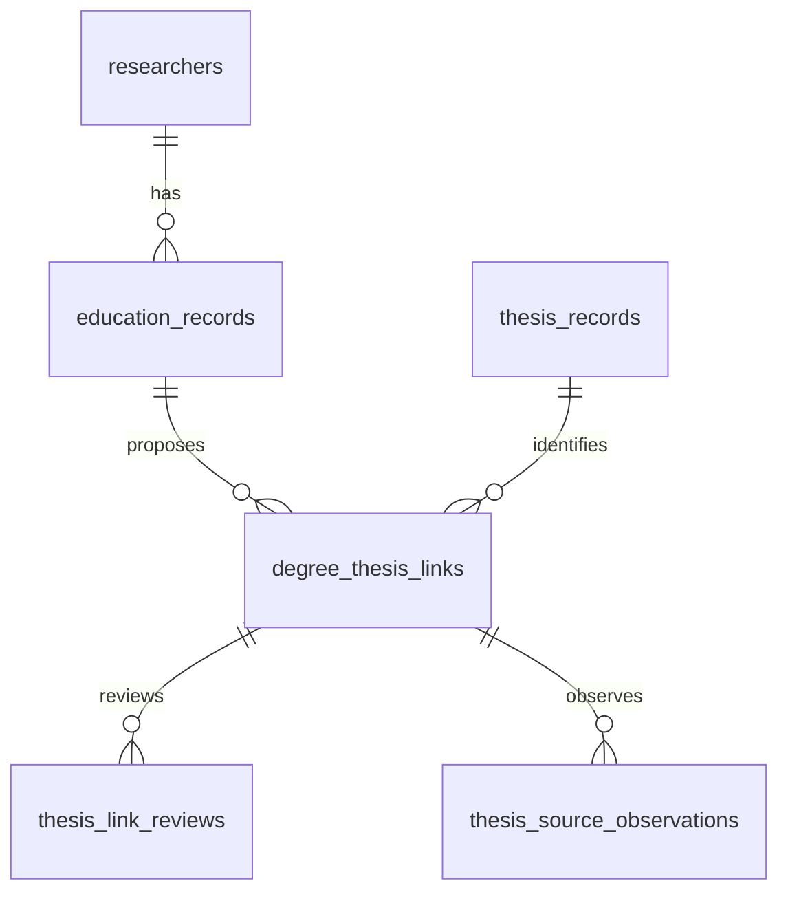

# 박사학위–졸업논문 연결

2026-09-10. 국내·해외 박사학위자 모두를 대상으로 한다. 교수 요약에 `thesis_url` 하나를 추가하는 대신 기존 비공개 연구자 식별자 DB를 버전 3으로 확장해 학위, 논문, 연결 검토와 도서관 관측 자료를 나눈다. 기존 원본 DB와 공개 파일은 수정하지 않는다.



## 테이블과 컬럼의 책임

| 테이블 | 주요 컬럼과 제약 | 용도 |
| --- | --- | --- |
| `education_records` | `degree_id` PK, `source_professor_uid` FK, `(source_snapshot_sha256, source_education_id)` UNIQUE | 원본의 개별 박사학위와 출처 스냅샷을 연결한다. 복수 박사학위를 막는 사람별 UNIQUE는 두지 않는다. |
| `education_records` | 기관 원문·표준명, 국가 원문·코드, `award_year`, `domestic_status`, `query_status` | 실제 학위연도와 기관 근거를 보존한다. 국가 미확인과 모순을 구분하고 현재 재직 학과를 가져오지 않는다. |
| `thesis_records` | `thesis_id` PK, `(provider, provider_record_id)` UNIQUE, 제목·저자·출판연도·출처 URL·DOI | RISS, OpenAlex, KAIST 및 서울대학교 공식 도서관의 논문 기록. 공급자가 보고한 학위종류·학과는 별도 컬럼이며 미제공 시 NULL이다. |
| `degree_thesis_links` | `(degree_id, thesis_id)` PK 및 FK, `status`, `match_method`, `evidence`, 검토자·시각 | 한 학위에 여러 후보를 둘 수 있다. 확정 상태에서는 학위별·논문별 유일성을 강제한다. |
| `thesis_link_reviews` | 연결 FK, 이전·새 상태, 검토자·시각·관측 근거 | 검토 이력을 누적하며 기존 이력의 수정·삭제를 막는다. |
| `thesis_source_observations` | 연결 FK, 관측·원본 파일·학위 스냅샷 SHA-256, 조회시각·방식, 비공개 원본 참조, 저자 필드와 원문 메타데이터 | 동일 도서관 기록을 다시 확인해도 앞선 자료를 덮어쓰지 않는다. 직접 조회와 검색 색인 관측을 구분하며 수정·삭제를 막는다. |
| `thesis_import_batches` | 입력 내용의 SHA-256 UNIQUE, 종류·시각·집계·감사 정보 | 같은 입력을 다시 가져와도 중복 생성하지 않는다. 오류가 있으면 해당 일괄 입력 전체를 되돌린다. |

원본의 정수 `education_id`는 DB 재생성 때 다른 행에 재사용될 수 있으므로 스냅샷 지문과 함께 식별한다. 같은 스냅샷의 학위·논문 메타데이터가 달라지면 덮어쓰지 않고 충돌을 보고한다. DOI는 중복 탐지에 사용하며 연구자 PK나 자동 병합 근거로 사용하지 않는다.

`v_phd_theses`는 논문이 아직 연결되지 않은 국내·해외 학위도 LEFT JOIN으로 남긴다. NULL 연결은 ‘논문이 없음’이라는 판정이 아니다. `v_domestic_phd_theses`는 국내·국내 국가 미해결 학위에 한정하며 국가 충돌은 전체 조회에서 따로 검토한다. `other_records_same_doi`는 공급자 기록 간 중복 가능성을 보여준다.

## 후보와 확정

원본 OpenAlex 자료에서 `work_type='dissertation'`, 기존 저자 판정 `keep`, 실제 수여연도와 출판연도의 차이가 ±1년 이내인 기록을 후보로 연결한다. 국내·해외 모두 적용하며 국가 충돌·미해결 유형, 복수 학위의 모호한 연결, 동일 논문의 메타데이터 충돌은 검토 대상으로 남긴다. 이미 존재하는 자료를 사용하며 새 RISS 검색 결과로 표시하지 않는다.

OpenAlex의 `dissertation`은 박사학위논문이라는 증거가 아니다. 원본 저자 매칭의 오류, 석사논문, 지도교수와 학생의 잘못된 연결 가능성이 남는다. 논문 소속이 학위기관과 같아도 학위 수여 사실을 입증하지 않는다. 자동 입력은 `candidate` 또는 `conflict`만 만들며 `verified`를 만들지 않는다.

확정에는 사람이 확인한 RISS 또는 지원 대학 도서관의 학위논문 상세 기록, 해당 논문의 제목, 저자, 박사학위 종류, 수여기관, 수여연도와 비공개 검토 기록 참조를 요구한다. 논문 제목과 학위의 저자·기관·연도를 실제 연결 대상과 대조한다. 학과를 확정할 때는 원문에 명시된 학과와 학과 확인 표시도 필요하다. CLI는 검토 근거의 형식과 일관성을 검사하며 외부 페이지를 대신 읽거나 본인인증을 수행하지 않는다.

같은 논문이 서로 다른 연구자에게 연결되면 충돌로 남긴다. 같은 DOI의 별도 기록이나 이미 확정된 다른 연결은 해소하기 전까지 새 확정을 막는다. 재수집은 이전 검토 결정을 덮어쓰지 않는다.

## 공식 대학 도서관 후보

`import-library`는 KAIST의 KOASAS `10203/...` 핸들과 도서관 서지 `bib:...`, 서울대학교 S-Space `10371/...` 핸들과 dCollection `dcollection:...` 기록을 지원한다. 공식 HTTPS 상세 URL과 공급자·서지 ID의 일치 여부를 검사한다. 검색 URL, 다른 도메인, 인증 매개변수는 허용하지 않는다. SNU dCollection의 `common/orgView/<12자리 ID>`는 같은 ID의 `srch/srchDetail` URL로 표준화한다.

후보 입력은 `degree_id`와 원본 스냅샷 해시뿐 아니라 저장된 원본 학위 ID·연구자 ID·이름·기관 ID와 표준명·학위연도·두 국가 코드를 모두 대조한다. 해당 도서관이 학위 수여기관인지도 별도로 검사한다. 지도교수와 구별된 실제 저자 필드에 학위자의 이름이 있어야 하며, 명시된 박사학위 문구와 수여연도 ±1년 이내 출판연도를 요구한다. 국가가 충돌하거나 같은 논문이 여러 연구자에게 연결되면 `conflict`로 남긴다. 원문에 기재된 학과는 `reported_department`에 보존하며 검증 완료 학과로 승격하지 않는다.

입력 JSON은 다음 구조를 사용한다. 실제 입력과 원본 자료는 비공개 경로에 둔다.

```text
{schema_version: 1, source: "Official university repository", candidates: [{
  degree_id, source_snapshot_sha256,
  anchors: {source_education_id, source_professor_uid, source_author_name,
            institution_unit_id, institution_canonical, award_year,
            education_country_code, institution_country_code},
  thesis: {provider, provider_record_id, title, author_text, publisher,
           publication_year, reported_degree_level: "phd", reported_department,
           doi, source_url},
  observation: {fetched_at, retrieval_method, source_sha256, record_reference,
                authors: [실제 저자 필드의 이름·표기 변형],
                source_metadata: {degree_statement: 실제 학위 문구, ...원문 필드}}
}]}
```

`retrieval_method`는 `direct_http` 또는 `web_indexed`다. `source_sha256`은 수집기가 저장한 관측 자료의 해시다. 직접 조회는 응답 자료, 색인 관측은 실제로 확인한 색인 텍스트를 저장·해시하며 후자를 실시간 HTML 조회로 표시하지 않는다. 저장된 자료는 `record_reference`로 찾을 수 있어야 한다. 입력기는 웹을 다시 조회하거나 파일 해시를 재계산하지 않고 이 수집 근거를 보존한다. 자동 입력은 관측 근거가 명확해도 후보로만 저장하며 사람의 검토를 수행했다고 기록하지 않는다.

버전 2에서 3으로 올릴 때 기존 논문·연결·검토·배치의 키와 행을 유지한다. 공급자 제약을 확장하고 관측 테이블을 추가한 다음, 트랜잭션 안에서 외래키 검사를 통과한 경우에만 새 버전을 확정한다. 마이그레이션 실패 시 스키마 변경을 포함해 되돌린다.

## 실행

실제 이름·외부 식별자·논문 제목이 있는 DB와 입력 파일은 전용 `private` 또는 `.private` 폴더에서만 관리한다. 기존 식별자 DB를 먼저 백업한 뒤 마이그레이션한다. 파일 권한은 0600, 전용 폴더는 0700이며 Git·공개 다운로드에 포함하지 않는다.

```bash
python3 backend/scripts/build_riss_queue.py \
  --private-project "$PRIVATE_BUILD_PROJECT" \
  --public-data public/data/dashboard.json --year 2026 --scope all \
  --output "$PRIVATE_DIRECTORY/riss-all-query-queue.json"

python3 backend/scripts/build_thesis_seed.py \
  --private-project "$PRIVATE_BUILD_PROJECT" \
  --public-data public/data/dashboard.json --year 2026 \
  --riss-queue "$PRIVATE_DIRECTORY/riss-all-query-queue.json" \
  --output "$PRIVATE_DIRECTORY/thesis-seed.json"

python3 backend/scripts/thesis_registry.py migrate \
  --database "$PRIVATE_DIRECTORY/researcher-identity.sqlite"

python3 backend/scripts/thesis_registry.py import \
  --database "$PRIVATE_DIRECTORY/researcher-identity.sqlite" \
  --records-json "$PRIVATE_DIRECTORY/thesis-seed.json"

# RISS 키 발급 및 실제 수집 후 사용한다.
python3 backend/scripts/thesis_registry.py import-riss \
  --database "$PRIVATE_DIRECTORY/researcher-identity.sqlite" \
  --candidates-json "$PRIVATE_DIRECTORY/riss-candidates.json"

python3 backend/scripts/thesis_registry.py import-library \
  --database "$PRIVATE_DIRECTORY/researcher-identity.sqlite" \
  --candidates-json "$PRIVATE_DIRECTORY/library-candidates.json"

python3 backend/scripts/thesis_registry.py summary \
  --database "$PRIVATE_DIRECTORY/researcher-identity.sqlite"
```

RISS 후보를 기존 학위에 연결할 때는 원본 연구자 ID·익명 ID·기관·연도·국가·이름을 대조한다. 여러 스냅샷에 동일한 학위가 있으면 `--source-snapshot-sha256`으로 대상을 지정해야 하며 임의로 최신 행을 선택하지 않는다. 수집기는 국내 `stype=id`, 해외 `stype=od`를 사용한다. 아직 RISS 키가 없어 실조회나 새로운 RISS 학과 검증은 수행하지 않았다.

현재 웹은 비공개 DB와 직접 연결되지 않는다. 공개 화면의 익명 정책을 유지하며 학위논문 제목·URL·저자·외부 ID는 공개 JSON에 추가하지 않는다. 확인된 학과의 웹 반영은 기존 [학위 학과 검증](CONSTELLATIONS_AND_FLOWS.md#국내-박사-학과의-2차-검증) 절차를 거친다.

## 로컬 반영 결과와 점검

2026-09-09에 기존 비공개 식별자 DB를 백업한 뒤 버전 2로 마이그레이션했다. 박사학위 3,916건, OpenAlex 논문 415건, 연결 416건(후보 414·충돌 2)을 저장했다. 국내 159명에 161개 연결, 해외 249명에 255개 연결이며 동일 해외 논문이 두 사람에게 연결된 경우를 충돌로 남겼다. 검증 완료는 0건이다. 후보가 없는 학위 3,508건도 보존한다.

원본에서 발견된 국가 충돌 64건과 수여연도 누락 187건은 미해결 상태로 보존했다. 추정 시작연도가 수여연도보다 늦은 122건은 이 연결 과정에서 사용하지 않으며 원본을 임의 수정하지 않았다. 동일 논문의 메타데이터 충돌 9건을 격리했고, 그중 1건이 다른 후보 조건을 충족했다.

전체 Python 테스트 98개가 통과했다. 실제 DB의 무결성·외래키 검사, 기존 연구자 및 식별자 행 수 보존, 같은 후보 입력 재수입의 무중복, 원본 SQLite의 SHA-256 불변을 확인했다. 비공개 DB는 0600, 전용 폴더는 0700이다. 키가 없는 상태에서 RISS 실조회는 하지 않았다.

### 2026-09-10 대학 도서관 추가 적재

KAIST 공식 도서관과 서울대학교 dCollection의 공개 상세 서지를 직접 조회했다. KAIST 관련 원본 학위 394건에 대해 검색하고 검색 결과가 한 페이지를 넘는 25건은 추가 조회했다. 서울대는 2012년 이후 학위 가운데 63건을 검색한 이번 수집분을 반영했다. 검색 대상 전체가 연결되었다는 의미는 아니며, 서울대의 나머지 학위는 이번 수집에 포함하지 않았다.

| 공급자 | 새 서지 기록 | 새 후보 연결 | 연결된 학위 |
| --- | ---: | ---: | ---: |
| KAIST 도서관 | 381 | 385 | 354 |
| 서울대학교 dCollection | 60 | 60 | 57 |
| 합계 | 441 | 445 | 411 |

기존에 연결이 없던 학위 287건이 새로 연결되어, 하나 이상의 논문 후보가 있는 학위는 408건에서 695건으로 늘었다. 전체 저장량은 서지 856건, 학위–논문 연결 861건(후보 851·충돌 10)이며 검증 완료는 0건이다. 도서관 기록 441건 중 학과 필드가 채워진 기록은 410건이다. 추가된 연결 445건 모두 직접 조회 방식·조회 시각·원문 자료 해시·비공개 원문 참조·실제 서지 필드를 보존한다.

새 도서관 자료에서 하나의 학위에 여러 후보가 있는 경우는 26건이다. 같은 KAIST 서지 기록이 서로 다른 연구자에 연결된 8개 연결은 충돌로 남겼다. 원본 기관의 표준명 충돌, 학위연도 누락, 저자 불일치 등은 별도 비공개 보류 자료로 보존했으며 원본 학위 값을 자동 수정하지 않았다. 이름의 한글·영문 표기는 원문의 실제 저자 필드만 사용하고 지도교수 필드는 저자 대조에서 제외했다.

기존 DB를 백업하고 동일 입력을 사본에서 먼저 검증한 뒤 버전 3으로 이전·적재했다. 이전 및 적재 후 기존 모든 행 보존, 무결성·외래키 검사, 재입력 시 행 불변, 공개 파일 해시 불변을 확인했다. 관련 전체 Python 테스트 110개가 통과했다. 실제 서지·연결 입력·출처 파일과 DB는 비공개 경로에만 저장했다.
